# PROMICE / GC-Net plot compilation

## Snow Height

### KAN_T – KAN_L – KAN_M – KAN_U

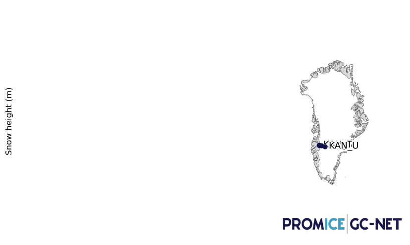

### QAS_L – QAS_M – QAS_U

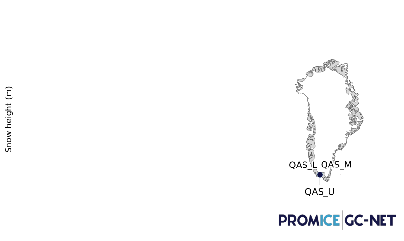

### SCO_L – SCO_U

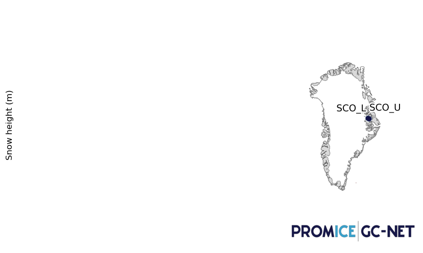

### KPC_L – KPC_U

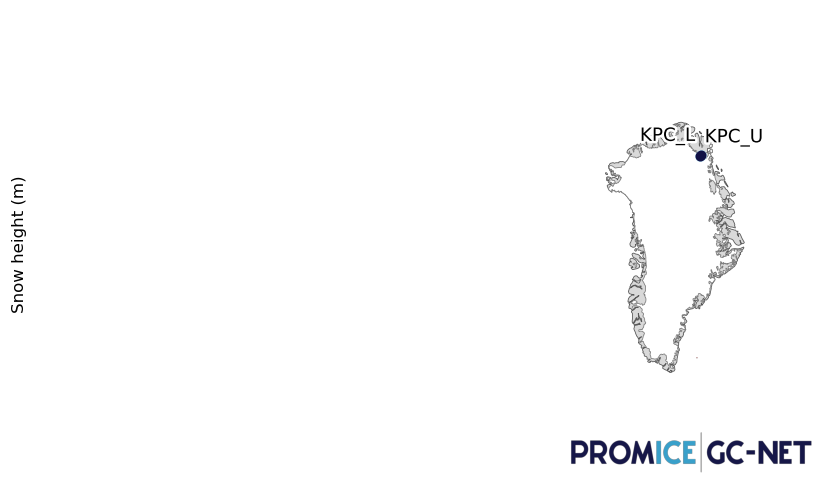

### JAR – SWC

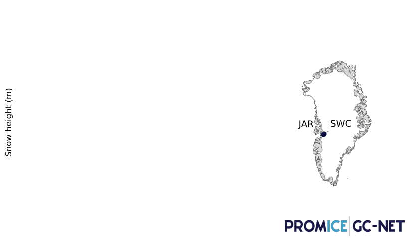

### TAS_L – TAS_A

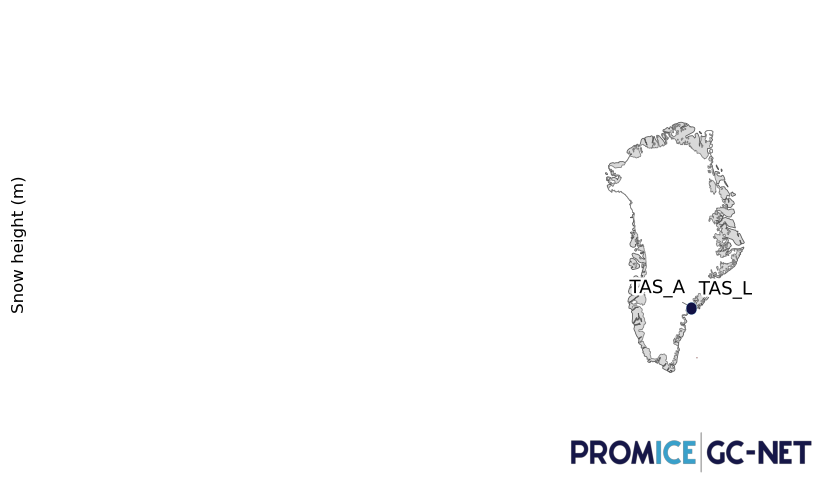

### THU_L – THU_U

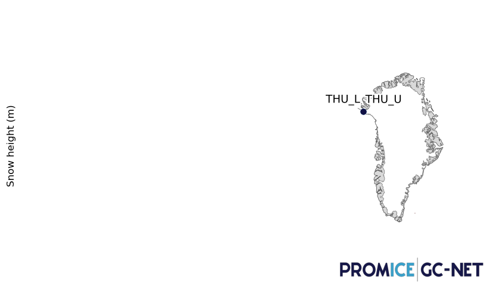

### NUK_L – NUK_U

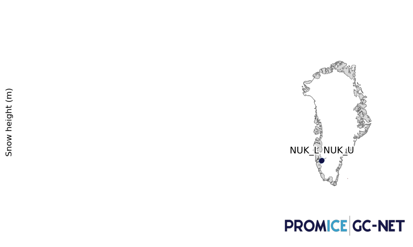

### UPE_L – UPE_U

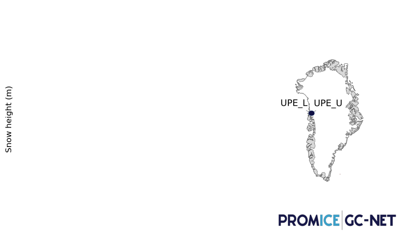

### ZAC_L – ZAC_U – ZAC_A

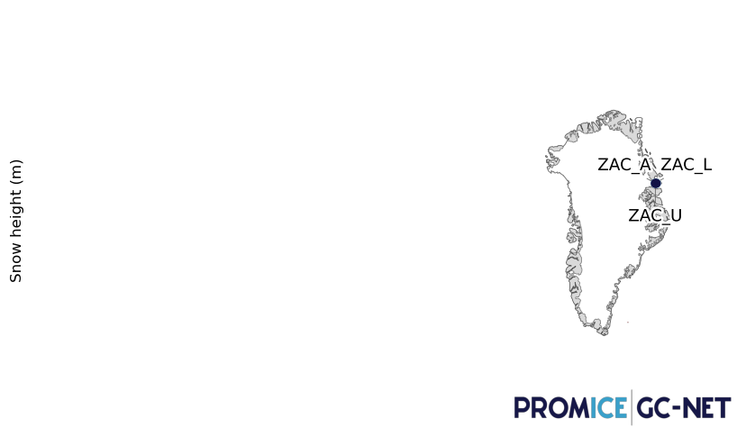

## T U

### KAN_T – KAN_L – KAN_M – KAN_U

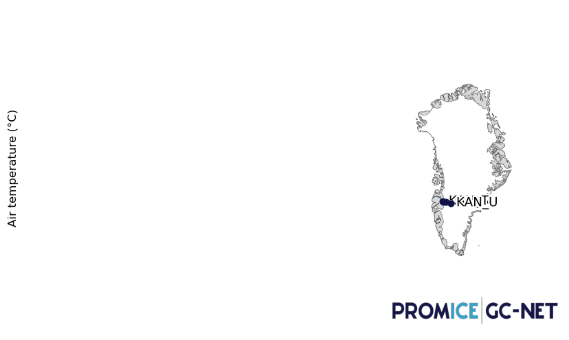

### QAS_L – QAS_M – QAS_U

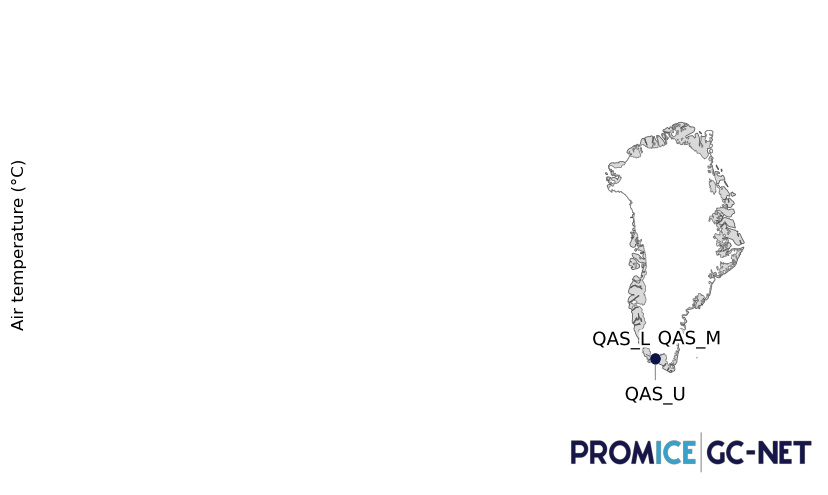

### SCO_L – SCO_U

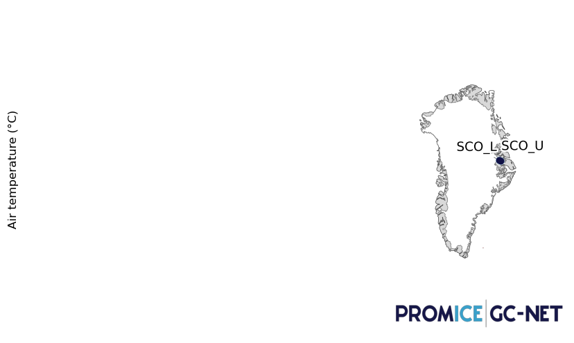

### KPC_L – KPC_U

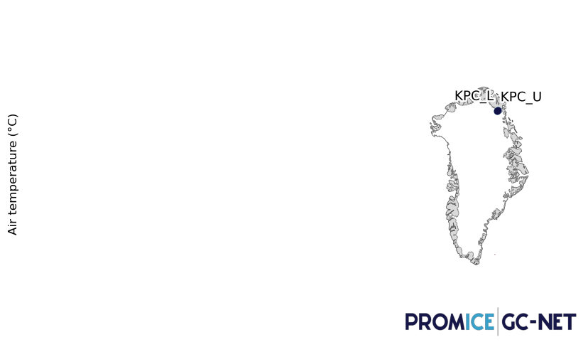

### JAR – SWC

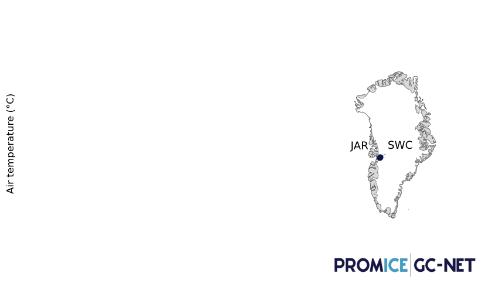

### TAS_L – TAS_A

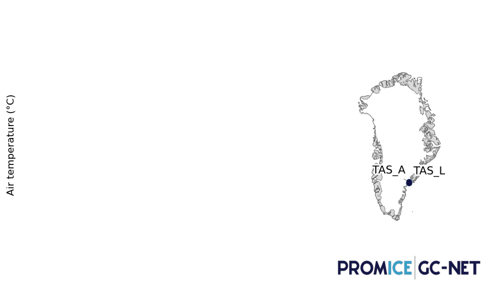

### THU_L – THU_U

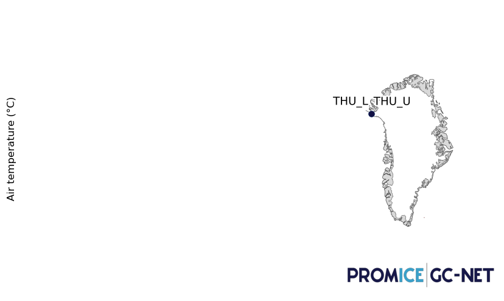

### NUK_L – NUK_U

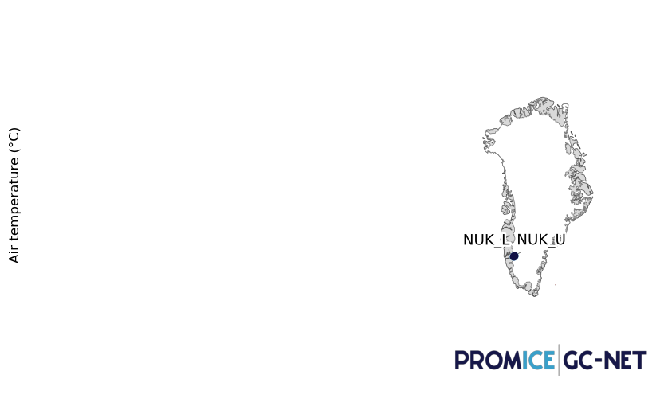

### UPE_L – UPE_U

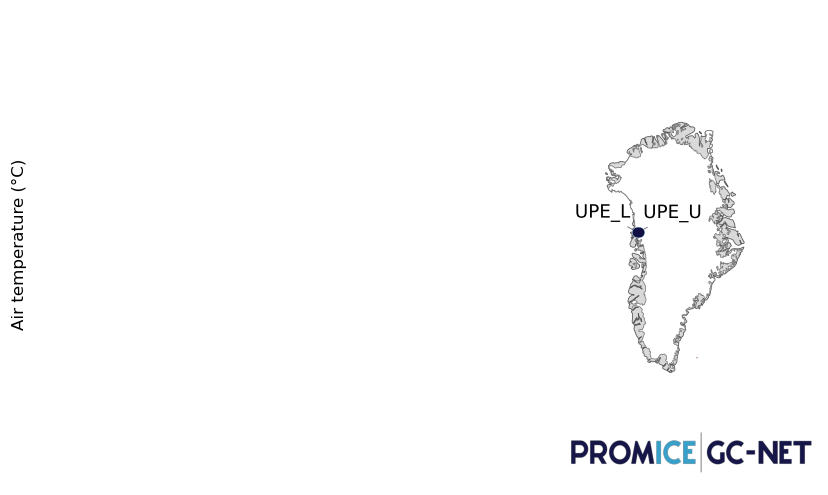

### ZAC_L – ZAC_U – ZAC_A

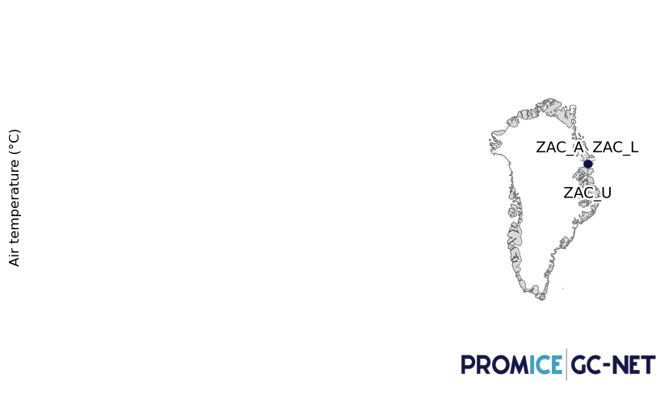
