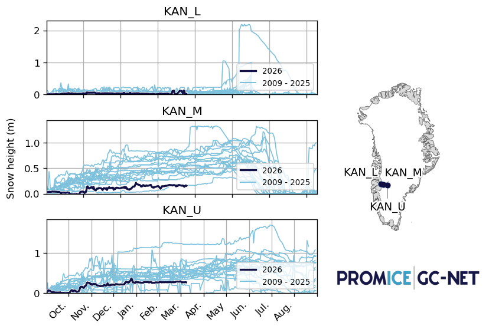
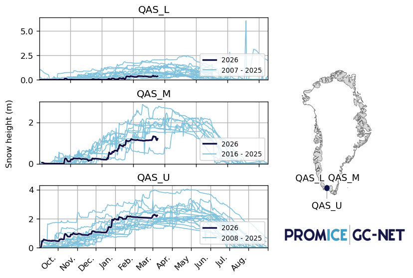
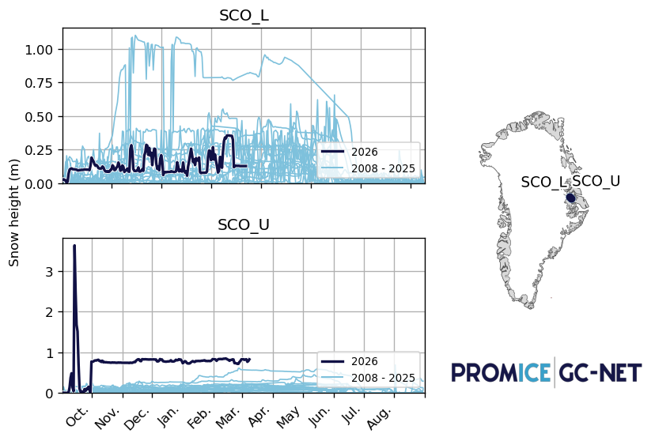
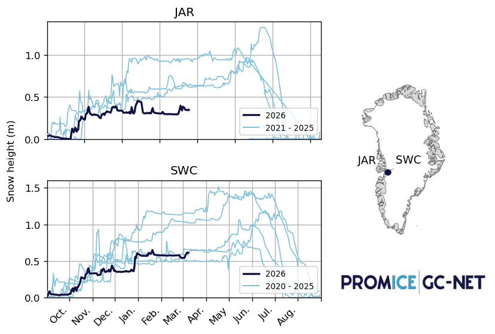
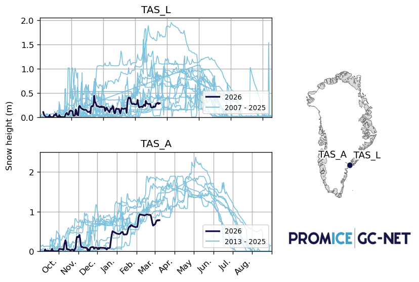
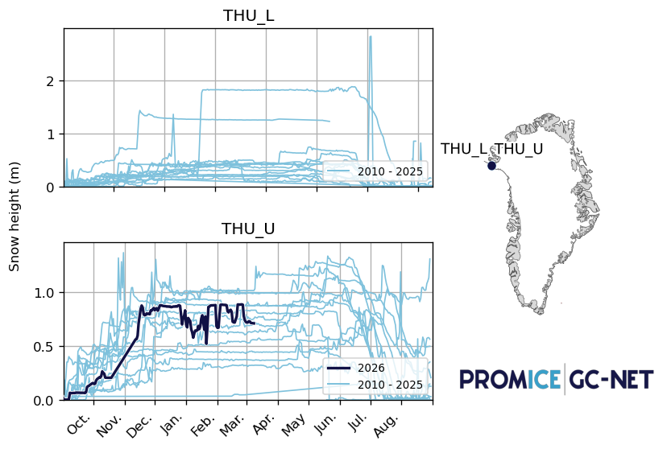

# PROMICE / GC-Net plot compilation

## Snow Height

### KAN_L – KAN_M – KAN_U

### QAS_L – QAS_M – QAS_U

### SCO_L – SCO_U

### JAR – SWC

### TAS_L – TAS_A

### THU_L – THU_U

## T U

### KAN_L – KAN_M – KAN_U

### QAS_L – QAS_M – QAS_U

### SCO_L – SCO_U

### JAR – SWC

### TAS_L – TAS_A

### THU_L – THU_U

